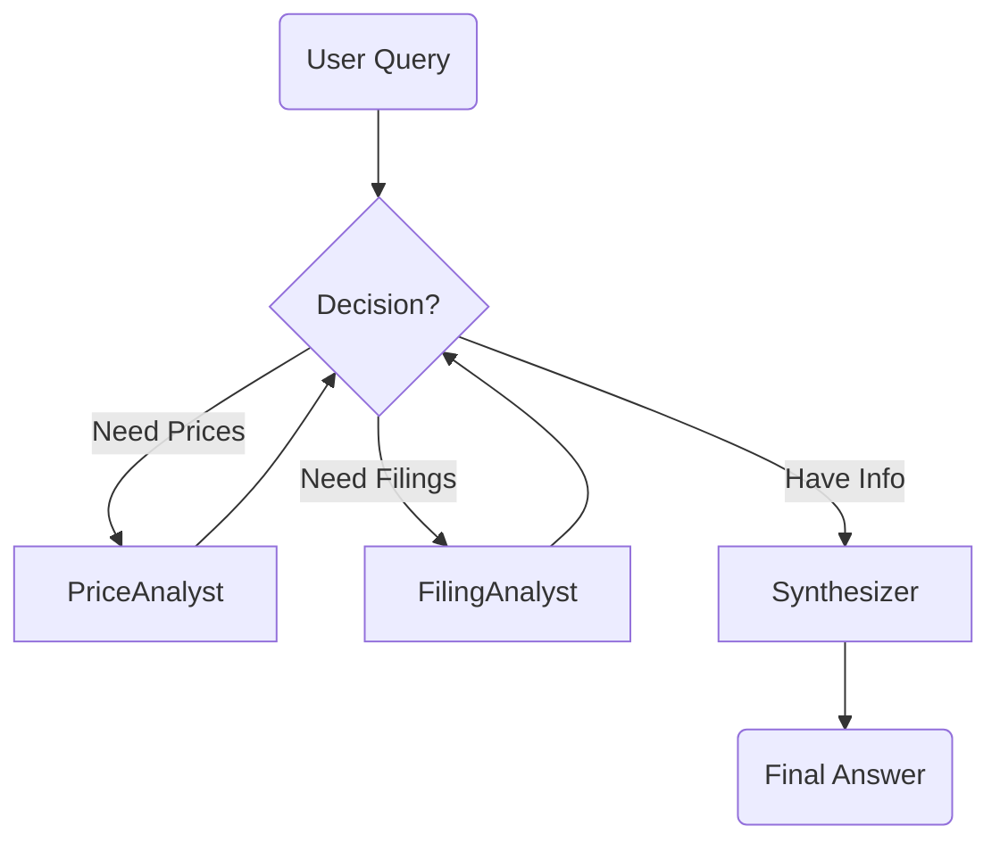

# Project: FinVault (Multi-Agent Financial Analyst)

**FinVault** is an interactive financial analysis application built with **Streamlit** and **LangGraph**. It simulates a real-world financial research team where a "Supervisor" agent delegates tasks to specialized "Analyst" agents to answer complex user queries about public companies.

This project demonstrates how to build a **Hierarchical Multi-Agent System** that runs locally using **Ollama**.

## Core Concepts

This project implements the **Supervisor-Worker Pattern**. Instead of a single LLM trying to do everything, the system is split into specialized roles:

1.  **Supervisor (Orchestrator):** Breaks down the user's query and decides which worker is needed next. It does not access tools directly; it manages the workflow.
2.  **Workers (Specialists):**
    *   **Price Analyst:** Uses `yfinance` to fetch and summarize historical stock price trends.
    *   **Filing Analyst:** Uses `edgartools` to fetch and summarize specific sections of SEC filings (10-Qs), such as "Risk Factors" or "Management's Discussion."
3.  **Synthesizer (Reporter):** Once all data is gathered, this agent compiles the findings into a polished, user-friendly report.

## Architecture

The application uses **LangGraph** to manage the state and flow between agents.



## Project Structure

- **`app.py`:** The Streamlit frontend. It handles the UI, session state, streaming agent thoughts, and user interaction.
- **`agent.py`:** Contains the **LangGraph** logic. Defines the nodes (agents), the edge logic (router), and the state (`AgentState`) that passes messages between them.
- **`tools.py`:** The specific tools utilized by the workers to access **Yahoo Finance** and **SEC EDGAR** APIs.
- **`config.py`:** Configuration settings for the LLM (Ollama), file paths, and environment variables.

## Setup & Installation

### 1. Install Dependencies

```bash
pip install streamlit langchain langchain-ollama langchain-community langgraph pydantic yfinance edgartools python-dotenv
```

### 2. Pull Ollama Model
This project is configured to use `qwen3:8b` by default (defined in `config.py`). It is a strong model for tool calling and reasoning.

```bash
ollama pull qwen3:8b 
# Note: You may need to update the model name in config.py if you choose a different model.
```

## Running the Application

1.  **Start the Streamlit App:**
    ```bash
    streamlit run app.py
    ```

2.  **Access the UI:**
    Open your browser to `http://localhost:8501`.

3.  **Enter Email (SEC Requirement):**
    The app uses the official SEC EDGAR database. You must provide a valid email address (e.g., `user@example.com`) to identify your user agent to the SEC API. This is not stored permanently, only for the session.

4.  **Ask a Question:**
    Try prompts like:
    > "Analyze NVIDIA (NVDA). Check their recent price performance and list their biggest risk factors from the latest 10-Q."

## Key Features to Observe

*   **Streaming Thoughts:** In the UI, expand the "Analyzing..." status box. You will see the **Supervisor** delegating tasks and the **Analysts** performing work in real-time.
*   **Structured Output:** Notice how the `tools.py` returns XML-formatted data. This helps the LLM parse large financial documents more accurately.
*   **State Persistence:** The app maintains conversation history. You can ask follow-up questions like "What about their cash flow?" and the Supervisor will remember the previous context.

## Notes

*   **SEC Rate Limiting:** The `edgartools` library accesses the SEC database. If you make too many requests too quickly, the SEC may temporarily block your User-Agent (email).
*   **Model Performance:** Financial analysis requires good reasoning. If the model seems confused, ensure you are using at least an 8B parameter model (like Llama 3.1 8B or Qwen 2.5 7B/14B). Small models (1B-3B) may struggle with the Supervisor logic.

---

## Acknowledgements
This project is heavily inspired by and based on the excellent tutorial by Venelin Valkov:
- **[Analyze Financial Data with AI! Build a Local Agentic RAG to Analyze Stocks (LangGraph & Ollama)](https://youtu.be/A6NjThI_7bg?si=KzXIPSYkIiz_Xx8c)**
