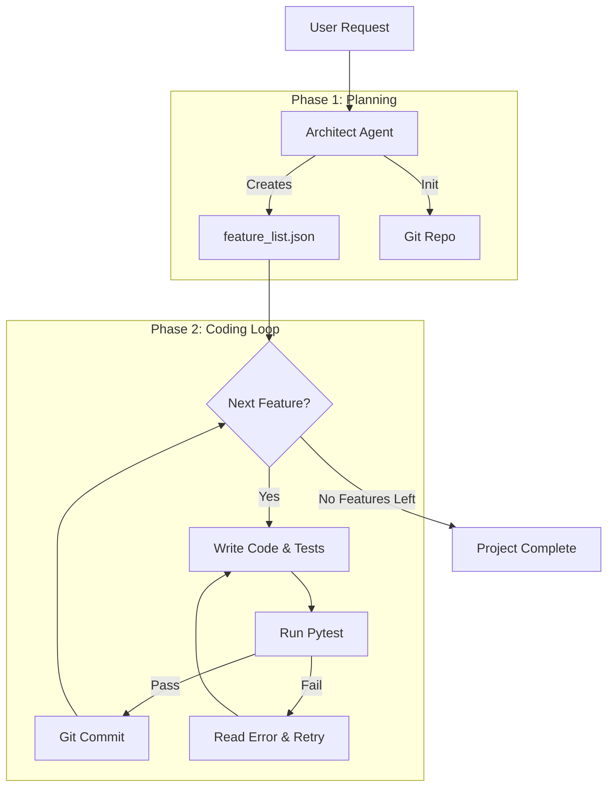

# Project: Long-Running AI Coding Agent

This project demonstrates how to build an **Autonomous Software Engineer Agent**. Unlike a chatbot that just gives you code snippets, this agent creates a real workspace, writes files to disk, runs its own tests, and commits valid code to Git.

It implements a **feedback loop**: if the tests fail, the agent reads the error, attempts to fix the code, and tries again.

## Core Concepts

This project introduces advanced agentic patterns:

1.  **Plan & Execute:** The system is split into an **Initializer** (Architect) that plans features and a **Coding Agent** (Developer) that implements them.
2.  **Tool Use (Shell & File System):** The agent isn't trapped in the chat window. It uses Python's `subprocess` to execute shell commands and write files.
3.  **Self-Correction Loop:**
    *   *Write Code* $\rightarrow$ *Run Tests* $\rightarrow$ *Read Errors* $\rightarrow$ *Refactor*
4.  **Structured Output:** Uses `Pydantic` to force the LLM to return strictly formatted data (filenames, code content) rather than free text.
5.  **State Persistence:** The agent maintains a `feature_list.json` to track progress, allowing it to "remember" what it has finished across execution steps.

## Architecture



## Workspace Structure

When you run the script, it creates a folder named `agent_workspace`. This is the agent's "sandbox."

```text
Long_Running_Coding_Agents/
├── long_running_agents.py    # The main agent logic
├── agent_workspace/          # (Created automatically)
│   ├── .git/                 # Real git history of the agent's work
│   ├── feature_list.json     # The plan tracks status (pass/fail)
│   ├── agent_progress.txt    # Human-readable log
│   ├── factorial.py          # Generated code
│   └── test_factorial.py     # Generated tests
```

## Setup & Installation

### 1. Install Dependencies
You need `langchain` and `pydantic`. `pytest` is required because the *agent* runs it to verify its code.

```bash
pip install langchain langchain-ollama pydantic pytest
```

### 2. Pull Ollama Model
This agent requires a model capable of **Structured Output** and **Reasoning**. The code is configured for `qwen3:8b`, which are excellent for coding tasks.

```bash
ollama pull qwen3:8b
```
*Note: If you use a different model, update `MODEL_NAME` in `long_running_agents.py`.*

## Running the Agent

Simply run the Python script. Watch the terminal to see the agent "thinking" and working.

```bash
python long_running_agents.py
```

### What to Expect:
1.  **Initialization:** The agent receives the prompt: *"Create Python functions for factorial and fibonacci."*
2.  **Planning:** It will generate `feature_list.json` containing two tasks.
3.  **Coding (Factorial):**
    *   It writes `factorial.py` and `test_factorial.py`.
    *   It runs `pytest`.
    *   If successful, it commits to git: `[git] commit -m "Implement factorial"`.
4.  **Coding (Fibonacci):** It repeats the process for the next feature.
5.  **Completion:** It prints a summary of completed features.

## Important Notes

*   **File Overwrites:** The script **deletes** the `agent_workspace` folder every time it runs to start fresh. Do not put your own important files in there!
*   **Loop Limits:** The `run_coding_session` function has a `max_retries` limit (default 3). If the agent cannot fix a bug after 3 tries, it skips that feature to prevent infinite loops.
*   **Git Requirement:** You must have `git` installed on your machine, as the agent runs `git init` and `git commit` commands via the shell.

## Code Deep Dive

*   **`AgentEnvironment` Class:** Encapsulates the OS interactions. It provides the "tools" for the agent: `write_file`, `read_file`, `run_shell`.
*   **`CodingAction` Pydantic Model:**
    ```python
    class CodingAction(BaseModel):
        code_files: dict[str, str]
        test_command: str
        commit_message: str
    ```
    This forces the LLM to return *exact* file contents and commands, preventing parsing errors common with standard chat models.

---

## Acknowledgements
This project is heavily inspired by and based on the excellent tutorial by Venelin Valkov:
- **[Build Local Long-Running AI Agent (Stop Your Agents from Getting Lost) | LangChain, Ollama, Pydantic](https://youtu.be/jjI5tijwHPE?si=mOXFn-ITMqeYyO2z)**
